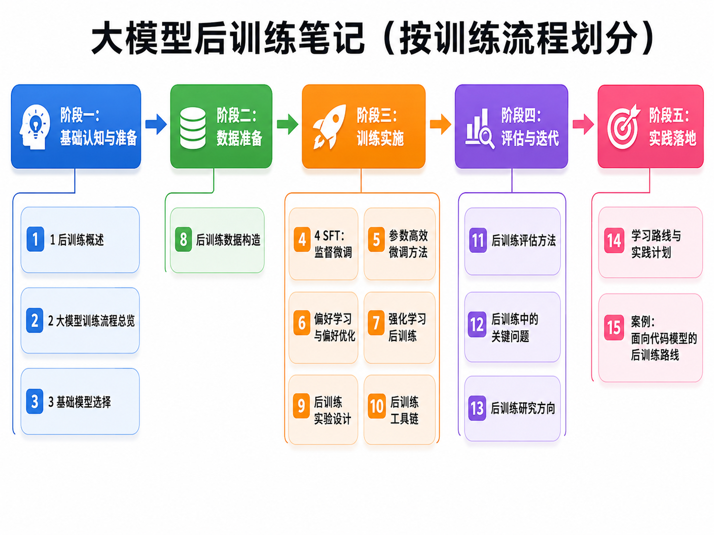

# 30天速通大模型后训练项目介绍

身处一个技术迭代速度极快的时代，很多岗位、技能栈，甚至职业路径都在被重新定义。  
作为一个曾在技术投资与职业选择上走过弯路的人，我越来越强烈地意识到：在不确定性持续放大的环境里，持续学习并重建自己的技术能力，已经不再是“加分项”，而是“生存项”。

大模型无疑是这个时代最值得投入的技术方向之一。相比“会用模型”，我更希望真正理解模型是如何被训练出来、如何被对齐、如何被优化，以及如何从一个基础模型一步步走到可用、好用、能落地的阶段。于是，我开始系统学习大模型后训练（Post-Training）相关内容。

然而，在实际学习过程中，我发现网上关于后训练的资料虽然很多，但大多比较碎片化：  

- 有的只讲概念，不讲完整流程；  
- 有的只讲某一种方法，不讲方法之间的关系；  
- 有的偏论文复现，不适合初学者建立整体认知；  
- 有的偏工程实践，却缺乏系统性的知识组织。  

因此，我决定开启这个项目：**《30天速通大模型后训练》**。  
希望通过一个尽可能清晰、系统、可持续更新的方式，把自己学习大模型后训练的过程沉淀下来，也为后来者提供一份更容易上手的学习路线图。这个项目既是我的个人学习笔记，也是一份希望能够真正帮助他人的系统化教程。  

## 更新说明

本项目内容会持续迭代更新。  
除了 GitHub 仓库外，相关内容也将**同步更新在微信公众号**：信安科研人，方便以更轻量的方式阅读与跟进。

如果你也在学习大模型后训练，欢迎一起交流、讨论、纠错与共建。

## 项目结构

后续内容将围绕如下主线逐步展开：

  

## 写在最后

这个项目的出发点并不复杂：  
不是为了制造焦虑，也不是为了追逐概念，而是希望在快速变化的技术浪潮中，认真学一点真正有价值、能够沉淀为长期能力的东西。

如果这份笔记恰好也能帮到你，那就再好不过了。

---

**持续学习，持续更新。**  
**欢迎 Star / Fork / 关注，一起完成这 30 天的大模型后训练速通。**
