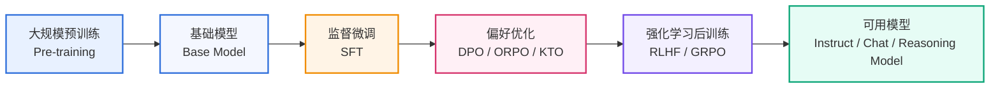
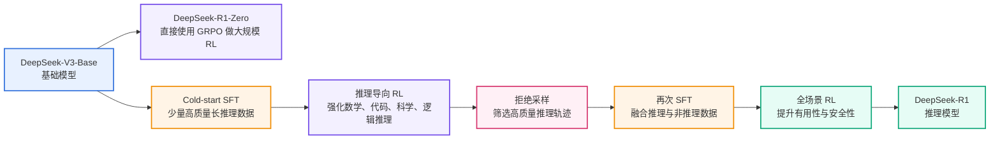
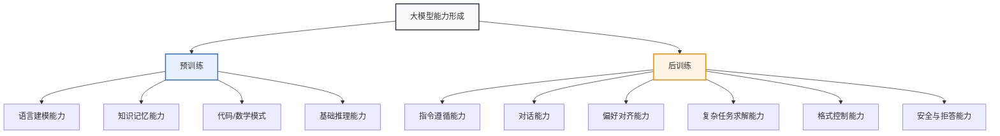
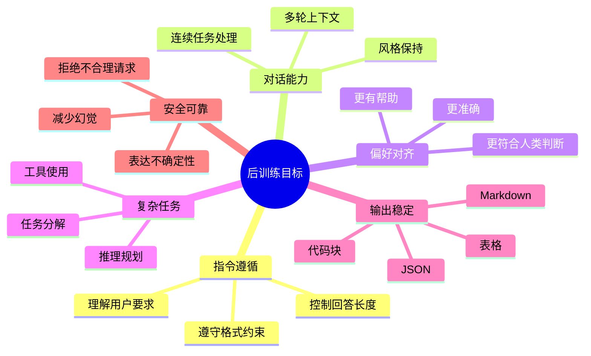
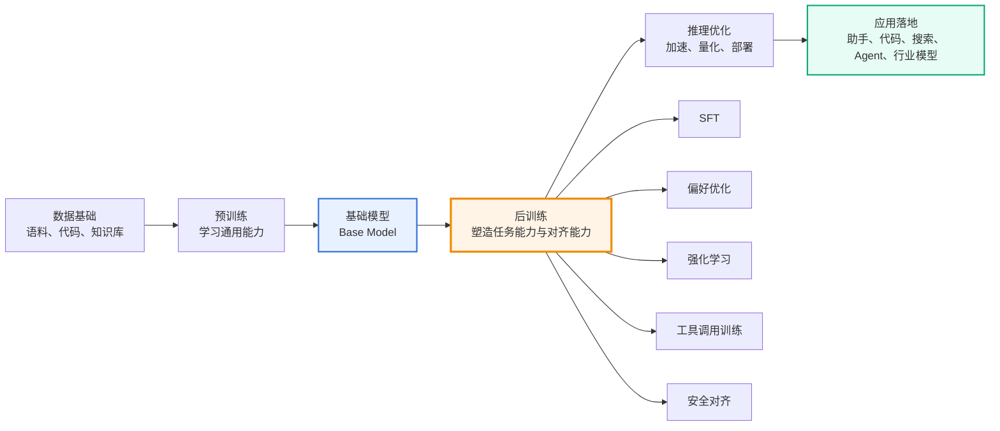
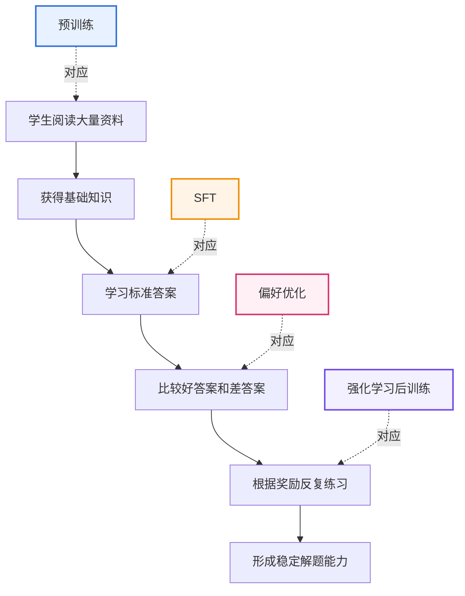
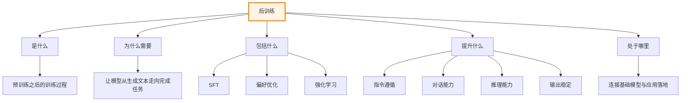

# 第 1 章 后训练概述

## 本章导读

大模型的能力并不是一次训练完成的。通常来说，一个大模型会先通过大规模语料进行**预训练**，获得基础语言能力、知识记忆能力和初步推理能力；随后再通过一系列后续训练过程，让模型更会回答问题、更能遵循指令、更符合人类偏好，也更适合具体任务。

这个预训练之后的训练阶段，通常被称为**后训练**。

后训练是当前大模型落地中非常关键的一环。很多我们日常使用的大模型能力，例如对话、问答、代码生成、数学推理、工具调用、拒绝不合理请求、按照格式输出等，并不完全来自预训练，而是在后训练阶段被进一步塑造和强化出来的。

本章主要回答四个主问题，并在最后的思考题中补充常见疑问：

1. 什么是后训练？
2. 后训练和预训练有什么区别？
3. 后训练主要提升模型的哪些能力？
4. 后训练在大模型能力体系中处于什么位置？

---

## 1.1 什么是后训练

**后训练**，英文通常称为 **Post-Training**，指的是在大模型完成大规模预训练之后，为了让模型更好地完成具体任务、遵循人类指令、符合人类偏好、具备更强推理能力而进行的一系列训练过程。

简单来说：

> 预训练让模型“学会语言和知识”，后训练让模型“学会如何更好地使用这些能力”。

一个模型经过预训练后，通常已经具备一定的语言建模能力。例如，它知道词语之间的关系，知道代码、数学、常识和各种文本模式。但是，这并不意味着它天然就是一个好用的聊天助手。

未经充分后训练的模型可能会出现以下问题：

- 不会稳定地按照用户指令回答；
- 回答格式不统一；
- 容易生成无关内容；
- 不知道什么回答更符合人类偏好；
- 多轮对话能力较弱；
- 推理过程不稳定；
- 对复杂任务缺乏任务分解能力；
- 对安全、拒答、事实性等要求把握不好。

因此，后训练的核心目标不是简单地继续堆数据，而是让模型从“会预测文本”进一步变成“会完成任务”。

---



<div align="center"><strong>图 1-1 大模型训练阶段示意图</strong></div>

从图中可以看到，后训练不是一个单独步骤，而是一组连续的训练过程。常见后训练过程包括：

- SFT：监督微调；
- DPO / ORPO / KTO：偏好优化；
- RLHF / RLAIF / GRPO：强化学习后训练；
- Rejection Sampling：拒绝采样；
- Tool-use Training：工具调用训练；
- Reasoning Fine-tuning：推理能力增强训练。

这些方法共同作用，使基础模型逐渐变成一个更可用、更可靠、更符合任务需求的模型。

### 案例：DeepSeek-R1 是如何进行后训练的

DeepSeek-R1 是理解后训练的一个典型案例。它的核心并不是简单地“多喂数据”，而是围绕推理能力设计了一套多阶段后训练流程。

根据 DeepSeek-R1 论文，DeepSeek-R1-Zero 直接以 DeepSeek-V3-Base 为基础模型，在不先进行 SFT 的情况下使用 GRPO 进行大规模强化学习，从而激发出自我验证、反思和长链式推理等能力。不过，R1-Zero 也暴露出可读性差、语言混杂等问题。因此，DeepSeek-R1 在此基础上加入了 cold-start 数据、推理导向 RL、拒绝采样生成 SFT 数据，以及面向全场景的进一步 RL 对齐。



<div align="center"><strong>图 1-2 DeepSeek-R1 后训练流程简化图</strong></div>

这个案例说明，后训练不是某一个单点算法，而是一条围绕目标能力不断迭代的训练链路：先让模型具备基本表达和可读性，再通过 RL 激发推理能力，随后用拒绝采样和 SFT 固化高质量行为，最后再通过更全面的 RL 让模型更符合实际使用需求。也就是说，SFT、偏好优化、强化学习和评估迭代通常是协同工作的，而不是彼此孤立的步骤。

> 参考资料：DeepSeek-AI, *DeepSeek-R1: Incentivizing Reasoning Capability in LLMs via Reinforcement Learning*, 2025.


---

## 1.2 后训练与预训练的区别

预训练和后训练都属于模型训练，但它们的目标、数据、方法和产物明显不同。

### 1.2.1 预训练关注“通用能力”

预训练的目标是让模型从大规模语料中学习语言规律和世界知识。  
它通常使用海量文本、代码、网页、书籍、论文等数据，训练模型预测下一个 token。

经过预训练后，模型能够获得：

- 基本语言理解能力；
- 常识知识；
- 代码和数学模式；
- 文本续写能力；
- 初步推理能力；
- 多领域知识表征。

但是，预训练模型通常不一定擅长对话，也不一定会按照人类指令完成任务。

例如，用户输入：

```text
请用三句话解释什么是后训练。
```

一个只经过预训练的模型可能会继续补全文本，而不是严格回答问题。它可能把这句话当成普通语料的一部分，而不是一个需要执行的指令。

### 1.2.2 后训练关注“可用能力”

后训练的目标是让模型更适合实际使用。它不是单纯让模型继续学习知识，而是让模型学会：

- 如何理解指令；
- 如何组织答案；
- 如何进行多轮对话；
- 如何选择更好的回答；
- 如何遵循格式约束；
- 如何在特定任务中表现更好；
- 如何减少无用、错误或不安全输出。

也就是说，后训练解决的是模型从“能生成文本”到“能完成任务”的问题。

---

| 对比维度 | 预训练 | 后训练 |
|---|---|---|
| 主要目标 | 学习语言规律和通用知识 | 提升指令遵循、任务完成和偏好对齐能力 |
| 训练数据 | 大规模原始语料 | 指令数据、对话数据、偏好数据、任务数据 |
| 典型方法 | 自回归语言建模 | SFT、DPO、RLHF、GRPO 等 |
| 关注重点 | “知道什么” | “如何回答、如何完成任务” |
| 模型产物 | Base Model | Instruct Model / Chat Model / Reasoning Model |
| 使用体验 | 可能不稳定、不一定听指令 | 更像可直接使用的助手 |
| 成本规模 | 通常极高 | 相对较低，但对数据质量要求更高 |

<div align="center"><strong>表 1-1 预训练与后训练的区别</strong></div>

---



<div align="center"><strong>图 1-3 预训练与后训练的能力分工</strong></div>

可以这样理解：

> 预训练决定模型的能力上限，后训练决定模型的可用程度。

当然，这句话不是绝对的。高质量后训练也可能显著提升某些任务能力，但如果基础模型本身能力较弱，仅靠后训练也很难让它在复杂任务上达到很高水平。

---

## 1.3 后训练的主要目标

后训练并不是为了单纯提高模型参数规模，而是为了让模型具备更好的使用能力。  
从实际应用角度看，后训练主要有以下几个目标。

### 1.3.1 提升指令遵循能力

指令遵循能力是指模型能否准确理解用户要求，并按照要求完成任务。

例如，用户要求：

```text
请用三句话解释 SFT，不要使用专业术语。
```

一个指令遵循能力好的模型应该同时满足：

- 只写三句话；
- 解释 SFT；
- 避免专业术语；
- 不跑题。

指令遵循能力差的模型可能会：

- 写成五六句话；
- 加入大量无关背景；
- 使用复杂术语；
- 没有直接回答问题。

### 1.3.2 提升对话能力

对话能力不仅是回答单个问题，还包括理解上下文、维持多轮一致性、记住用户前文要求。

例如：

```text
用户：请用简洁风格解释什么是 SFT。
模型：SFT 是用人工标注的输入输出样本训练模型，让模型学会按照指令回答。

用户：那 DPO 呢？保持刚才的风格。
```

一个好的模型应该知道“保持刚才的风格”指的是继续使用简洁风格解释 DPO。

这种能力通常需要多轮对话数据和对话式后训练来增强。

### 1.3.3 提升偏好对齐能力

偏好对齐是指模型的回答更符合人类对“好答案”的判断。

对于同一个问题，可能有多个可行回答，但质量不同。

例如，用户问：

```text
什么是后训练？
```

回答 A：

```text
后训练就是预训练之后的训练。
```

回答 B：

```text
后训练是指在基础模型预训练完成后，通过监督微调、偏好优化和强化学习等方法，使模型更好地遵循指令、完成任务并符合人类偏好的训练过程。
```

回答 B 通常更好，因为它更完整、更准确，也更有信息量。

偏好优化的目的，就是让模型更倾向于生成类似回答 B 的内容，而不是生成回答 A 这种过于粗略的内容。

### 1.3.4 提升复杂任务能力

很多真实任务不是简单问答，而是需要多步处理。例如：

- 阅读一篇论文并总结贡献；
- 分析一段代码并解释逻辑；
- 根据需求生成项目方案；
- 比较多个技术路线；
- 根据反馈修改已有内容；
- 调用工具完成查询或计算；
- 在约束条件下生成结构化输出。

这些任务需要模型具备任务分解能力、上下文理解能力、推理能力和格式控制能力。

后训练可以通过高质量任务数据和推理数据，让模型在复杂任务中表现更稳定。

### 1.3.5 提升输出格式稳定性

在工程应用中，模型不只是要“答得对”，还要“格式稳定”。

例如，系统要求模型输出 JSON：

```json
{
  "task": "summary",
  "result": "后训练用于提升模型的指令遵循和任务完成能力。"
}
```

如果模型输出了额外解释、非法 JSON、缺少字段，就可能导致下游程序解析失败。

因此，后训练经常会加入格式约束类数据，让模型学会稳定输出：

- JSON；
- Markdown；
- 表格；
- YAML；
- 函数调用参数；
- 结构化报告；
- 代码块。

### 1.3.6 提升安全性与可靠性

模型在实际使用中需要避免生成明显错误、有害、虚假或不符合任务边界的内容。

后训练可以帮助模型学习：

- 何时拒绝不合理请求；
- 如何减少幻觉；
- 如何表达不确定性；
- 如何基于证据回答；
- 如何避免编造信息；
- 如何在高风险场景中更谨慎。

这类能力并不是靠预训练自然稳定获得的，通常需要专门的安全对齐数据、偏好数据和评估机制。

---



<div align="center"><strong>图 1-4 后训练的主要能力目标</strong></div>

---

## 1.4 后训练在大模型能力体系中的位置

从完整的大模型能力体系看，后训练处在**连接基础能力与应用能力**的位置。

预训练提供基础能力，后训练负责塑造使用方式，推理部署负责将模型真正放到实际系统中运行。

---



<div align="center"><strong>图 1-5 大模型能力体系中的后训练位置</strong></div>

后训练不是孤立存在的。它与数据、模型、评估、部署都有密切关系。

一个完整的大模型项目通常需要考虑：

1. 选择什么基础模型；
2. 构造什么训练数据；
3. 使用什么后训练方法；
4. 如何设计评估指标；
5. 如何发现失败案例；
6. 如何迭代数据和训练策略；
7. 如何部署和优化推理性能。

因此，学习后训练不能只学习某一个算法，而应该建立完整流程意识。

---

## 1.5 一个直观例子：从基础模型到助手模型

为了更直观地理解后训练，可以把模型想象成一个学生。

### 预训练阶段

预训练像是让学生阅读大量书籍、网页、代码和资料。  
这个阶段结束后，学生拥有了大量知识，但不一定知道如何考试、如何答题、如何与人交流。

### SFT 阶段

SFT 像是给学生看标准答案。  
学生开始学习：面对某类问题，应该如何组织答案。

### 偏好优化阶段

偏好优化像是老师告诉学生：两个答案中哪个更好，为什么更好。  
学生不只是学会回答，还开始学会选择更符合人类偏好的回答方式。

### 强化学习阶段

强化学习像是让学生在任务中反复练习，并根据得分不断调整策略。  
如果回答更准确、更符合目标，就获得更高奖励；如果回答无效或错误，就需要调整。

---



<div align="center"><strong>图 1-6 后训练类比图</strong></div>

这个类比可以帮助理解：

- 预训练提供知识基础；
- SFT 提供标准回答模式；
- 偏好优化提供好坏判断；
- 强化学习提供目标驱动的持续优化。

---

## 1.6 本章小结

本章介绍了大模型后训练的基本概念。

可以总结为以下几点：

1. **后训练是在预训练之后进行的训练过程**，目标是让模型更适合实际任务和人类使用。
2. **预训练关注通用能力，后训练关注可用能力**。预训练让模型获得知识和语言能力，后训练让模型学会如何回答、如何对齐、如何完成任务。
3. **指令微调是后训练的一部分，但后训练不等于指令微调**。完整后训练还包括偏好优化、强化学习、工具调用训练、安全对齐等。
4. **后训练的目标包括指令遵循、对话能力、偏好对齐、复杂任务能力、格式稳定性和安全可靠性**。
5. **后训练连接基础模型和实际应用**，是大模型从“能生成文本”走向“能稳定完成任务”的关键阶段。

---



<div align="center"><strong>图 1-7 本章核心图谱</strong></div>

---

## 思考题

### 1. 为什么说预训练模型不一定是一个好用的聊天模型？

**答案：**

预训练模型的主要目标是学习文本分布，也就是根据上下文预测下一个 token。它通过海量语料获得语言知识、世界知识和一定的推理模式，但它并不天然知道“用户正在下达指令”，也不一定知道应该如何组织一个符合人类期待的回答。

因此，只经过预训练的模型可能会出现以下问题：

- 把用户问题当成普通文本继续补全，而不是认真回答；
- 回答格式不稳定；
- 对多轮对话上下文理解不足；
- 不知道什么样的答案更有帮助；
- 对拒答、安全性、事实性和风格控制缺乏稳定约束。

所以，预训练模型有基础能力，但不等于已经具备良好的产品可用性。后训练的作用，就是把基础模型进一步塑造成可对话、可控、可评估、可落地的模型。

---

### 2. 后训练和指令微调是什么关系？

**答案：**

指令微调，也就是 SFT，是后训练中的一个重要阶段，但后训练不等于指令微调。

可以这样理解：

- **后训练**是一个大概念，包含 SFT、偏好优化、强化学习、工具调用训练、安全对齐、推理增强等多个阶段；
- **SFT**只是其中的一个阶段，主要作用是让模型学会按照指令回答问题；
- SFT 更像是让模型先“会回答”，而偏好优化和强化学习则进一步让模型“回答得更好”“更符合目标”。

例如，一个模型经过 SFT 后，可能已经能按照用户要求生成答案，但它不一定能稳定判断哪个答案更好，也不一定能在复杂推理任务中持续优化策略。这时就需要 DPO、RLHF、GRPO 等后续训练方法进一步改进。

一句话概括：

> SFT 是后训练的一部分；后训练是一整套把基础模型变成可用模型的训练流程。

---

### 3. 为什么仅靠 SFT 可能不够？

**答案：**

SFT 的本质是让模型模仿训练数据中的标准答案。如果数据质量高，SFT 可以显著提升模型的指令遵循能力和输出格式稳定性。但它也有明显局限。

主要问题包括：

- SFT 更擅长模仿，不一定擅长比较“哪个答案更好”；
- 如果训练数据有错误，模型也会学习错误模式；
- 如果答案模板太固定，模型容易过拟合格式；
- 对复杂推理任务，SFT 可能只学到表面过程，而没有真正优化求解策略；
- 对开放式任务，SFT 很难覆盖所有可能的用户需求和回答风格。

因此，在 SFT 之后，通常还需要偏好优化或强化学习。偏好优化通过 chosen/rejected 数据告诉模型什么回答更好；强化学习则通过奖励信号让模型围绕目标能力持续改进。

---

### 4. 后训练主要提升的是模型的知识量，还是模型的使用方式？

**答案：**

后训练主要提升的是模型的**使用方式**，而不是单纯增加知识量。

预训练阶段通常负责让模型吸收大规模知识和语言模式；后训练阶段更关注如何把这些能力调用出来，并以符合人类需求的方式表达出来。例如：

- 是否听懂用户指令；
- 是否按照指定格式输出；
- 是否能进行多轮对话；
- 是否能给出更有帮助的回答；
- 是否能在复杂任务中分步骤推理；
- 是否能避免明显错误和不合理输出。

当然，后训练也可能补充部分领域知识，但它的核心价值不是“继续背知识”，而是塑造模型的行为模式、任务能力和对齐能力。

---

### 5. 在一个实际项目中，为什么后训练必须和数据、评估、部署一起考虑？

**答案：**

后训练不是孤立的训练算法问题，而是一个完整工程链路问题。

如果只训练、不重视数据，模型可能会学习错误样本、低质量答案或重复模板。如果只训练、不评估，就无法判断模型到底提升在哪里、失败在哪里。如果只训练、不考虑部署，训练出的模型可能推理成本过高、响应太慢，或者无法适配实际业务系统。

一个实际后训练项目通常需要同时回答以下问题：

- 数据从哪里来，质量是否可靠？
- 训练目标是什么，是指令遵循、推理能力，还是格式稳定性？
- 用什么方法训练，是 SFT、DPO，还是 GRPO？
- 用什么指标评估，如何发现失败案例？
- 模型是否能在目标硬件上部署？
- 推理速度、显存占用和成本是否可接受？

因此，后训练应该被看作“数据构造—训练实施—评估迭代—部署落地”的闭环，而不是一个单独的模型微调命令。

---

### 6. 后训练能提升的能力，感觉 Agent 也能做出来，如何看待这个问题？

**答案：**

这个问题非常关键。很多能力看起来既可以通过后训练获得，也可以通过 Agent 系统实现，例如任务分解、工具调用、检索资料、代码执行、反思修正等。但二者的定位不同。

**后训练优化的是模型本体能力。** 也就是说，模型在不依赖复杂外部流程的情况下，就能更好地理解指令、组织答案、遵守格式、进行推理和对齐偏好。它提升的是模型的内生能力，优点是调用简单、延迟低、稳定性更好，缺点是训练成本高，而且能力更新需要重新训练或继续微调。

**Agent 优化的是系统能力。** Agent 可以通过规划、工具调用、记忆、检索、执行反馈和多轮自修正，把一个普通模型包装成更强的任务系统。它的优点是灵活、可插拔、可利用外部工具和环境反馈，缺点是链路更长、成本更高、稳定性依赖流程设计，且每一步都可能引入误差。

二者不是替代关系，而是互补关系：

- 后训练适合提升高频、通用、内生的模型能力；
- Agent 适合处理长流程、强工具依赖、需要外部环境反馈的复杂任务；
- 最理想的路线通常是：先通过后训练得到一个更可靠的基础模型，再用 Agent 架构扩展它的外部行动能力。

简单来说：

> 后训练让模型本身更强，Agent 让模型接入工具和流程后变成更强的系统。

如果一个能力需要低延迟、高稳定、频繁调用，优先考虑后训练；如果一个能力需要查资料、跑代码、调工具、访问环境、长期规划，则更适合交给 Agent 系统。


## 推荐阅读顺序

读完本章后，可以继续阅读：

```text
第 2 章 大模型训练流程总览
→ 第 3 章 基础模型选择
→ 第 4 章 SFT：监督微调
→ 第 6 章 偏好学习与偏好优化
→ 第 7 章 强化学习后训练
```

第一章的核心作用是建立全局认知。后续章节会围绕后训练流程逐步展开：先理解训练流程，再选择基础模型，然后进入 SFT、偏好优化和强化学习等具体方法。

---

## 参考资料

- DeepSeek-AI. [DeepSeek-R1: Incentivizing Reasoning Capability in LLMs via Reinforcement Learning](https://arxiv.org/html/2501.12948v1), 2025.

