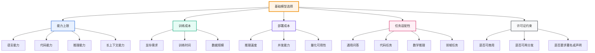
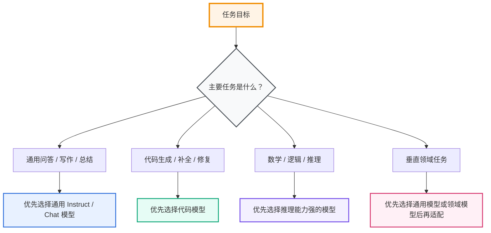
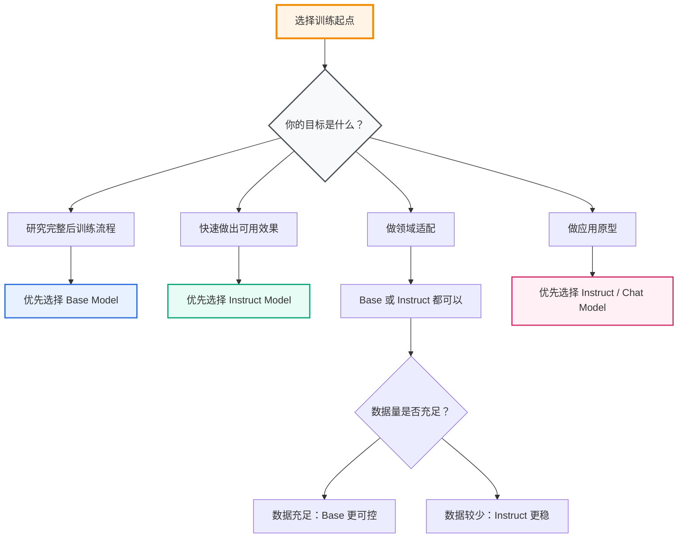
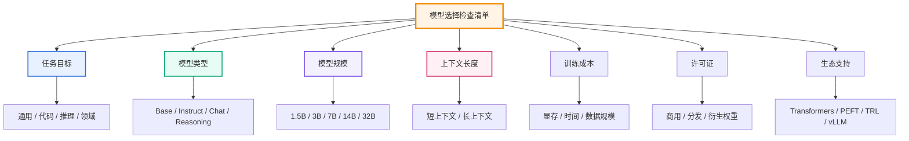
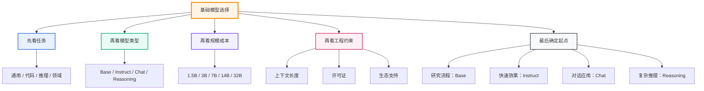

# 第 3 章 基础模型选择

## 本章导读

后训练的第一步不是立刻写训练代码，而是先回答一个问题：**到底应该基于哪个模型继续训练？**

这个问题非常关键。因为后训练不是从零开始训练模型，而是在已有模型的基础上继续优化。基础模型的能力、规模、许可证、上下文长度、领域倾向和工程成本，都会直接影响后训练的效果。

如果基础模型选错，后面的数据构造、SFT、DPO、GRPO、评估和部署都会变得困难。例如：

- 模型太小，复杂任务能力不足；
- 模型太大，训练和部署成本过高；
- 选择了 Instruct 模型，却误以为它是纯 Base 模型；
- 选择了通用模型，却希望它在代码任务上超过专门代码模型；
- 忽略许可证，导致后续开源或商用受限；
- 忽略 tokenizer 和上下文长度，导致训练数据被严重截断。

因此，本章的目标是建立一套**基础模型选择方法论**。你需要知道不同模型类型的区别，也要知道在个人实验、研究复现和项目落地中应该如何做取舍。

本章主要回答六个问题：

1. Base Model、Instruct Model 和 Chat Model 有什么区别？
2. 通用模型、代码模型、领域模型分别适合什么场景？
3. 后训练到底应该从 Base 模型开始，还是从 Instruct 模型开始？
4. 选择模型时需要看哪些指标？
5. 常见开源模型应该如何理解？
6. 为什么个人实验通常推荐从 7B 左右模型开始？

---

## 3.1 为什么基础模型选择重要

后训练并不是魔法。它不能无限弥补基础模型本身的能力缺陷。

一个基础模型可以理解为后训练的“地基”。如果地基本身不稳，后面即使加入大量数据和训练技巧，也很难得到稳定结果。

例如，假设你想做一个技术问答模型：

- 如果基础模型中文能力很弱，后训练很难让它突然具备高质量中文表达能力；
- 如果基础模型代码能力很弱，只靠少量代码 SFT 很难让它变成强代码模型；
- 如果基础模型推理能力很弱，DPO 或 RL 可能只能改善输出偏好，而难以显著提升复杂推理上限；
- 如果基础模型太大，个人设备可能无法完成训练和部署；
- 如果基础模型许可证限制严格，后续项目发布可能受限。

所以，基础模型选择决定了三件事：

1. **能力上限**：模型原本能做到什么程度；
2. **训练成本**：需要多少显存、时间和数据；
3. **应用边界**：是否适合你的任务、设备和发布方式。

---



<div align="center"><strong>图 3-1 基础模型选择影响后训练全流程</strong></div>

---

## 3.2 Base Model、Instruct Model 与 Chat Model

学习后训练时，最容易混淆的概念是 Base Model、Instruct Model 和 Chat Model。

它们不是同一个东西，也不适合完全相同的训练目标。

---

## 3.2.1 Base Model

**Base Model** 是指主要经过预训练得到的基础模型。

它通常具备较强的语言建模能力，但不一定会稳定遵循用户指令。Base Model 更像一个“文本续写器”，它擅长根据上下文继续生成文本，但未必知道自己应该扮演助手角色。

Base Model 适合用于：

- 从头构建完整后训练流程；
- 研究 SFT、DPO、RLHF、GRPO 的真实效果；
- 做模型对齐、推理增强、任务能力塑造等实验；
- 需要严格控制后训练过程的研究项目。

Base Model 的优点是起点更干净，研究价值更高。  
缺点是初始可用性较差，通常需要更多高质量 SFT 数据。

---

## 3.2.2 Instruct Model

**Instruct Model** 是指已经经过指令微调的模型。

它通常已经具备一定的问答能力、指令遵循能力和格式控制能力。例如，很多开源模型会提供 `Base` 和 `Instruct` 两个版本：

```text
Qwen2.5-7B
Qwen2.5-7B-Instruct
```

这里的 `Instruct` 就表示该模型已经经过指令微调，不再是纯 Base 模型。

Instruct Model 适合用于：

- 个人入门实验；
- 小规模领域适配；
- 快速做任务微调；
- 构建应用原型；
- 数据量有限的场景。

Instruct Model 的优点是开箱即用，训练门槛低。  
缺点是它已经被对齐过，后续训练很难区分“模型原始能力”和“已有后训练能力”的贡献。

---

## 3.2.3 Chat Model

**Chat Model** 是更偏对话场景的模型。

它通常不仅经过指令微调，还经过多轮对话数据训练、安全对齐和偏好优化。因此，它更适合作为聊天助手或应用系统的底座。

Chat Model 适合用于：

- 多轮对话助手；
- 客服问答；
- 写作助手；
- Agent 系统；
- 面向用户的交互产品。

Chat Model 的优点是对话体验更好。  
缺点是它的回答风格和安全策略可能已经比较固定，不一定适合做底层训练研究。

---

## 3.2.4 Reasoning Model

近年来还出现了更明确面向推理能力的 **Reasoning Model**。

这类模型通常通过推理数据、拒绝采样、强化学习或可验证任务训练，强化了数学、代码、逻辑推理等能力。DeepSeek-R1 就是典型代表之一，其公开论文显示，DeepSeek-R1-Zero 从 DeepSeek-V3-Base 出发使用 GRPO 进行大规模强化学习，而 DeepSeek-R1 进一步结合了 cold-start SFT、推理 RL、拒绝采样与 SFT，以及面向全场景的 RL 训练。[^deepseekr1]

Reasoning Model 适合用于：

- 数学推理；
- 代码推理；
- 复杂问答；
- 多步规划；
- 需要中间推理过程的任务。

但如果你的目标是研究“如何从基础模型训练出推理能力”，直接使用已经训练好的 Reasoning Model 作为起点，可能会掩盖你的方法贡献。

---

<div align="center">

<table>
  <thead>
    <tr>
      <th>模型类型</th>
      <th>主要特点</th>
      <th>适合场景</th>
      <th>不适合场景</th>
    </tr>
  </thead>
  <tbody>
    <tr>
      <td>Base Model</td>
      <td>主要经过预训练，指令遵循能力弱</td>
      <td>研究完整后训练流程、做方法验证</td>
      <td>快速应用、低成本原型</td>
    </tr>
    <tr>
      <td>Instruct Model</td>
      <td>已经经过指令微调，能较好回答问题</td>
      <td>个人实验、领域适配、小规模微调</td>
      <td>严格分析 SFT 原始增益</td>
    </tr>
    <tr>
      <td>Chat Model</td>
      <td>面向多轮对话和助手体验优化</td>
      <td>聊天助手、客服、Agent、交互产品</td>
      <td>需要完全控制输出风格的底层研究</td>
    </tr>
    <tr>
      <td>Reasoning Model</td>
      <td>强化数学、代码、逻辑等推理能力</td>
      <td>复杂推理、数学、代码、规划任务</td>
      <td>研究推理能力从零形成的过程</td>
    </tr>
  </tbody>
</table>


---

## 3.3 通用模型与代码模型

除了 Base、Instruct、Chat 这种训练阶段划分，还可以按照模型能力倾向划分为通用模型和代码模型。

---

## 3.3.1 通用模型

通用模型面向广泛任务，例如：

- 日常问答；
- 文本总结；
- 翻译；
- 写作；
- 信息抽取；
- 多轮对话；
- 简单推理；
- 常识问答。

通用模型适合做泛化能力较强的助手，也适合作为很多领域模型的基础。

常见通用开源模型包括：

- Qwen 系列；
- Llama 系列；
- DeepSeek 系列；
- Mistral 系列；
- Yi 系列；
- InternLM 系列。

通用模型的优点是覆盖面广。  
缺点是对于代码、数学、医学、法律等强专业任务，不一定比专门模型更强。

---

## 3.3.2 代码模型

代码模型在预训练或后训练阶段加入了更多代码数据，因此更擅长代码相关任务。

代码模型适合：

- 代码生成；
- 代码补全；
- 代码解释；
- 程序修复；
- 单元测试生成；
- 代码重构；
- 算法题求解；
- 工程脚本生成。

例如，Qwen2.5-Coder 是 Qwen 的代码专用模型系列。官方介绍中，Qwen2.5-Coder 覆盖 0.5B、1.5B、3B、7B、14B、32B 等多个规模，并强调其在代码生成、代码推理和代码修复等任务上的能力。[^qwen25coder]

如果你的 30 天项目后续案例选择“面向代码模型的后训练路线”，那么代码模型通常比通用模型更适合作为起点。

---

## 3.3.3 通用模型与代码模型的选择原则

选择原则可以简单概括为：

> 任务越通用，越适合从通用模型开始；任务越偏代码，越适合从代码模型开始。

例如：

- 做通用中文助手：优先考虑通用 Instruct 模型；
- 做代码助手：优先考虑代码 Instruct 模型；
- 做数学推理：优先考虑推理能力强的模型；
- 做特定领域问答：可以从通用模型或领域模型开始，再做领域 SFT。

---



<div align="center"><strong>图 3-2 按任务类型选择模型起点</strong></div>

---

## 3.4 领域模型与任务模型

除了通用模型和代码模型，还有一类模型是面向特定领域或特定任务优化的模型。

---

## 3.4.1 领域模型

领域模型是针对某个专业领域进行训练或微调的模型，例如：

- 医疗模型；
- 法律模型；
- 金融模型；
- 教育模型；
- 科研助手模型；
- 工业领域模型。

领域模型的优势是专业术语、知识结构和回答风格更贴近目标场景。  
但它也可能存在泛化能力下降、数据过时、领域偏见等问题。

如果你的目标是构建某个垂直领域助手，可以考虑两条路线：

1. 从通用模型开始，自己构造领域数据做 SFT；
2. 从已有领域模型开始，继续做任务适配。

第一条路线更可控，第二条路线更省成本。

---

## 3.4.2 任务模型

任务模型不是按领域划分，而是按具体能力划分，例如：

- 摘要模型；
- 翻译模型；
- 检索问答模型；
- 工具调用模型；
- 数学推理模型；
- 代码生成模型；
- 结构化输出模型。

任务模型通常更适合落地，但不一定适合做通用后训练研究。  
因为它已经针对具体任务做过优化，你很难判断后续训练到底是在提升基础能力，还是只是在微调输出风格。

---

## 3.4.3 领域模型和任务模型的风险

使用领域模型或任务模型时，需要注意三个风险：

1. **能力边界不清晰**：不知道它已经接受过哪些数据和训练；
2. **评估容易虚高**：如果评估集与原训练数据相似，结果可能不可靠；
3. **继续训练不稳定**：模型已有偏好和风格可能与新数据冲突。

因此，对于初学者来说，领域模型和任务模型可以作为应用起点，但不一定是最好的学习起点。

---

<div align="center">

<table>
  <thead>
    <tr>
      <th>模型类别</th>
      <th>优点</th>
      <th>风险</th>
      <th>建议用途</th>
    </tr>
  </thead>
  <tbody>
    <tr>
      <td>通用模型</td>
      <td>覆盖面广，生态成熟</td>
      <td>专业任务可能不够强</td>
      <td>通用助手、领域适配、教学实验</td>
    </tr>
    <tr>
      <td>代码模型</td>
      <td>代码生成和代码理解更强</td>
      <td>非代码任务可能不如通用模型自然</td>
      <td>代码助手、程序修复、代码推理</td>
    </tr>
    <tr>
      <td>领域模型</td>
      <td>专业术语和领域风格更贴近目标场景</td>
      <td>数据来源和训练过程可能不透明</td>
      <td>垂直行业应用</td>
    </tr>
    <tr>
      <td>任务模型</td>
      <td>特定任务效果好，落地快</td>
      <td>泛化能力和可迁移性不确定</td>
      <td>具体产品功能或单点任务</td>
    </tr>
  </tbody>
</table>

</div>


---

## 3.5 常用开源模型介绍

开源模型发展很快，具体版本会持续变化。本节不追求罗列所有模型，而是说明选择时应该如何理解常见模型家族。

---

## 3.5.1 Qwen 系列

Qwen 是目前常用的开源模型系列之一，覆盖通用模型、代码模型、数学模型、多模态模型等多个方向。

Qwen3 系列公开资料显示，它包含 Dense 和 MoE 模型，规模覆盖 0.6B、1.7B、4B、8B、14B、32B、30B-A3B 和 235B-A22B 等，并支持 thinking mode 和 non-thinking mode 的切换，以适配复杂推理和高效对话场景。[^qwen3]

对于个人后训练实验来说，Qwen 系列的优势包括：

- 中文能力较好；
- 模型尺寸选择多；
- 工具生态成熟；
- 有通用模型和代码模型；
- 适合做 LoRA / QLoRA 实验；
- 适合中文教程项目。

如果你的目标是“30 天速通后训练”，Qwen 系列通常是非常适合入门的选择。

---

## 3.5.2 Qwen2.5-Coder 系列

Qwen2.5-Coder 是代码任务中非常常用的开源模型系列。

官方资料显示，Qwen2.5-Coder 覆盖 0.5B、1.5B、3B、7B、14B、32B 等多个规模，方便开发者根据资源选择合适模型。[^qwen25coder]

其中，`Qwen2.5-Coder-7B-Instruct` 是个人实验中比较常见的起点。它已经具备一定指令遵循和代码问答能力，适合做：

- 代码问答微调；
- 代码解释数据 SFT；
- 程序修复任务微调；
- 单元测试生成；
- 小规模 DPO 实验；
- 代码推理风格优化。

需要注意的是，`Qwen2.5-Coder-7B-Instruct` 已经是 Instruct 模型，不是纯 Base 模型。如果你要研究“从基础模型开始的 SFT 效果”，应该选择非 Instruct 版本。

---

## 3.5.3 Llama 系列

Llama 是 Meta 发布的开源权重模型系列，在海外生态和工具链中非常常见。

Meta 的 Llama 3.3 官方模型卡显示，Llama 3.3 是一个 70B 的 instruction-tuned text-only 模型，相比 Llama 3.1 70B 和 Llama 3.2 90B 在性能上有增强。[^llama33]

Llama 系列的优势包括：

- 生态成熟；
- 英文能力强；
- 海外工具适配好；
- 社区模型多；
- 适合研究和应用原型。

如果你的主要任务是英文数据、英文评估集或国际开源生态，Llama 是常见选择。  
如果你的主要任务是中文教程、中文问答或中文代码解释，Qwen 或其他中文能力较强的模型可能更方便。

---

## 3.5.4 DeepSeek 系列

DeepSeek 系列在代码和推理方向有较高关注度。DeepSeek-R1 的公开论文重点展示了通过强化学习激发推理能力的路线，尤其是 R1-Zero 从 DeepSeek-V3-Base 出发进行纯 RL 的过程。[^deepseekr1]

DeepSeek 系列适合用于理解：

- 推理模型训练；
- GRPO；
- RL 如何提升推理能力；
- cold-start SFT 与 RL 的关系；
- 推理模型的训练流程。

对于个人实验来说，如果你只是刚入门后训练，不一定需要直接复现 DeepSeek-R1 这种高成本流程。更现实的做法是：先用 7B 左右模型跑通 SFT 和 DPO，再理解 GRPO 的小规模实验方法。

---

## 3.5.5 其他模型系列

除了上述模型，还有很多值得关注的开源模型，例如：

- Mistral / Mixtral；
- Yi；
- InternLM；
- Baichuan；
- GLM；
- Gemma；
- Phi；
- StarCoder；
- CodeLlama；
- DeepSeek-Coder。

选择这些模型时，不要只看榜单分数，而要结合自己的任务和资源判断。

---

<div align="center">

<table>
  <thead>
    <tr>
      <th>模型系列</th>
      <th>主要特点</th>
      <th>适合场景</th>
      <th>入门建议</th>
    </tr>
  </thead>
  <tbody>
    <tr>
      <td>Qwen</td>
      <td>中文能力较好，尺寸丰富，生态成熟</td>
      <td>中文问答、通用助手、后训练教学</td>
      <td>优先推荐</td>
    </tr>
    <tr>
      <td>Qwen2.5-Coder</td>
      <td>面向代码任务优化，覆盖多个尺寸</td>
      <td>代码生成、代码解释、程序修复</td>
      <td>代码方向优先推荐</td>
    </tr>
    <tr>
      <td>Llama</td>
      <td>英文生态成熟，社区资源丰富</td>
      <td>英文任务、国际评测、通用研究</td>
      <td>适合英文场景</td>
    </tr>
    <tr>
      <td>DeepSeek</td>
      <td>代码和推理方向突出</td>
      <td>推理训练、代码任务、RL 学习</td>
      <td>适合进阶研究</td>
    </tr>
    <tr>
      <td>Mistral / Mixtral</td>
      <td>推理效率和 MoE 方向有特色</td>
      <td>高效推理、英文应用、模型对比</td>
      <td>可作为对比模型</td>
    </tr>
    <tr>
      <td>Gemma / Phi</td>
      <td>小模型生态较好，便于本地实验</td>
      <td>轻量部署、小规模实验</td>
      <td>适合资源有限场景</td>
    </tr>
  </tbody>
</table>

</div>


---

## 3.6 如何选择后训练起点模型

选择模型时，不要只问“哪个模型最强”，而应该问：

> 在我的任务、数据、硬件和目标下，哪个模型最合适？

---

## 3.6.1 第一步：明确任务目标

先判断你要做什么任务。

常见目标包括：

- 通用问答；
- 中文助手；
- 英文助手；
- 代码生成；
- 代码解释；
- 数学推理；
- 工具调用；
- 多轮对话；
- 特定领域问答；
- 结构化输出。

不同目标对应不同起点。

例如：

- 中文通用助手：可以选 Qwen Instruct；
- 代码模型后训练：可以选 Qwen2.5-Coder；
- 英文通用实验：可以选 Llama；
- 推理训练研究：可以关注 DeepSeek-R1 路线；
- 小显存本地实验：可以选 1.5B、3B、7B 模型。

---

## 3.6.2 第二步：判断从 Base 还是 Instruct 开始

这是初学者最常问的问题。

选择原则如下：

- 如果你想研究完整后训练流程，优先选 Base Model；
- 如果你想快速做出效果，优先选 Instruct Model；
- 如果你数据很少，优先选 Instruct Model；
- 如果你想严格评估 SFT 的贡献，必须选 Base Model；
- 如果你想做应用原型，Instruct Model 通常更合适。

---



<div align="center"><strong>图 3-3 Base 与 Instruct 起点选择决策图</strong></div>

---

## 3.6.3 第三步：评估模型规模

模型规模直接影响训练成本和部署成本。

个人实验中常见规模选择如下：

<div align="center">

<table>
  <thead>
    <tr>
      <th>模型规模</th>
      <th>特点</th>
      <th>适合场景</th>
      <th>建议</th>
      <th>显卡要求</th>
    </tr>
  </thead>
  <tbody>
    <tr>
      <td>0.5B 到 1.5B</td>
      <td>非常轻量，训练和推理成本低</td>
      <td>流程验证、教学演示、快速试错</td>
      <td>适合第一次跑通流程</td>
      <td>单卡 8GB 到 12GB 通常可进行 LoRA / QLoRA 级别实验；推理要求更低</td>
    </tr>
    <tr>
      <td>3B 到 4B</td>
      <td>成本较低，能力比小模型更稳定</td>
      <td>个人实验、小数据微调</td>
      <td>适合资源有限但想看效果</td>
      <td>建议单卡 12GB 到 24GB；QLoRA 更稳，Full Fine-tuning 不推荐个人尝试</td>
    </tr>
    <tr>
      <td>7B 到 8B</td>
      <td>能力和成本较平衡</td>
      <td>SFT、DPO、领域适配、代码模型实验</td>
      <td>最推荐的入门规模</td>
      <td>建议单卡 24GB 起步做 QLoRA；LoRA 更建议 24GB 到 48GB；全量微调通常需要多卡</td>
    </tr>
    <tr>
      <td>14B</td>
      <td>能力更强，但训练资源要求明显提升</td>
      <td>较严肃实验、论文复现</td>
      <td>需要更充足 GPU 资源</td>
      <td>建议 48GB 以上显存做 QLoRA / LoRA；更稳定的实验通常需要 A100 / H100 或多卡环境</td>
    </tr>
    <tr>
      <td>32B 及以上</td>
      <td>能力更强，成本高</td>
      <td>高质量应用、进阶研究、大资源团队</td>
      <td>不建议初学者直接开始</td>
      <td>通常需要多卡 80GB 级别 GPU；个人本地训练成本很高，更适合云端或团队资源</td>
    </tr>
  </tbody>
</table>


对于个人后训练入门，通常建议从 **7B 左右 Instruct 模型**开始。  
原因是它在效果和成本之间比较平衡：模型足够强，可以看到训练效果；同时又不会像 32B 以上模型那样对硬件要求过高。

---

## 3.6.4 第四步：检查上下文长度

上下文长度决定了模型一次能处理多少 token。

如果你的训练数据是短问答，8K 上下文通常已经够用。  
如果你的数据包含长文档、长代码、多轮对话或工具调用轨迹，就需要更长上下文。

选择模型时需要关注：

- 原生上下文长度；
- 是否支持长上下文扩展；
- tokenizer 对中文和代码是否友好；
- 训练框架是否支持目标上下文长度；
- 显存是否能承受长序列训练。

上下文越长，训练显存和计算成本通常越高。不要盲目追求长上下文，而要看任务是否真的需要。

---

## 3.6.5 第五步：检查许可证

模型许可证决定你能不能商用、能不能再分发、能不能发布衍生模型。

选择模型前需要确认：

- 是否允许商用；
- 是否允许修改；
- 是否允许分发微调后的权重；
- 是否要求保留声明；
- 是否存在用户规模限制；
- 是否允许用于你的目标场景。

对于学习项目，许可证问题可能暂时不明显。  
但如果你的项目未来要开源、商用或投稿论文，许可证必须提前确认。

---

## 3.6.6 第六步：检查生态和工具支持

一个模型是否好用，不只看模型本身，还要看生态。

需要确认：

- Transformers 是否支持；
- PEFT 是否支持；
- TRL 是否支持；
- LLaMA-Factory 是否支持；
- vLLM 是否支持；
- 是否有官方 tokenizer；
- 是否有 GGUF / AWQ / GPTQ 量化版本；
- 社区是否有成熟训练脚本；
- 是否容易下载和复现。

对于初学者，优先选择生态成熟的模型，可以节省大量环境配置时间。

---



<div align="center"><strong>图 3-4 基础模型选择检查清单</strong></div>

---

## 3.7 以 Qwen2.5-Coder 为例的模型选择分析

本节用 `Qwen2.5-Coder-7B-Instruct` 作为例子，演示如何分析一个后训练起点模型。

---

## 3.7.1 这个模型是什么

从名称看：

```text
Qwen2.5-Coder-7B-Instruct
```

可以拆成四部分：

- `Qwen2.5`：模型家族；
- `Coder`：代码专用模型；
- `7B`：参数规模约 7B；
- `Instruct`：已经经过指令微调。

因此，它不是纯基础模型，而是一个已经具备指令遵循能力的代码模型。

---

## 3.7.2 它适合做什么

它适合做：

- 代码解释；
- 代码生成；
- 代码补全；
- 代码修改；
- 程序修复；
- 单元测试生成；
- 代码问答；
- 小规模代码任务 SFT；
- 代码偏好优化实验。

如果你的案例章节是“面向代码模型的后训练路线”，它是一个非常合适的起点。

---

## 3.7.3 它不适合做什么

它不太适合做：

- 研究从 Base 到 Instruct 的完整 SFT 增益；
- 评估纯预训练模型的指令学习能力；
- 构建非代码领域的通用聊天助手；
- 需要完全重新塑造风格的底层研究；
- 极低资源设备上的训练。

如果你想研究完整后训练流程，可以考虑选择 `Qwen2.5-Coder-7B` 的 Base 版本，再自己进行 SFT。

---

## 3.7.4 个人实验推荐路线

对于个人学习者，可以采用如下路线：


<div align="center"><strong>图 3-5 基于 Qwen2.5-Coder-7B-Instruct 的个人实验路线</strong></div>

这条路线的好处是门槛低、反馈快、结果容易观察。你不需要一开始就复现完整 RLHF 或 GRPO 流程，而是先把模型下载、推理、SFT、评估、DPO 这些基础环节跑通。

---

## 3.8 本章小结

本章介绍了如何选择后训练的起点模型。

可以总结为以下几点：

1. **基础模型选择决定后训练的能力上限、训练成本、部署成本和任务适配性**。
2. **Base Model、Instruct Model、Chat Model 和 Reasoning Model 不同**，它们适合不同实验目标。
3. **通用模型适合广泛任务，代码模型适合代码任务，领域模型适合垂直场景，任务模型适合具体应用功能**。
4. **初学者不应该只看榜单分数，而应该结合任务、数据、硬件、上下文长度、许可证和工具生态综合判断**。
5. **个人实验通常推荐从 7B 左右 Instruct 模型开始**，因为它在效果和成本之间比较平衡。
6. **如果目标是研究完整后训练流程，Base Model 更合适；如果目标是快速做出可用效果，Instruct Model 更合适**。
7. **Qwen2.5-Coder-7B-Instruct 是代码方向个人实验的合适起点，但它不是纯 Base 模型**。

---

## 本章核心图谱



<div align="center"><strong>图 3-6 本章核心图谱</strong></div>

---

## 思考题与参考答案

### 问题 1：Base Model 和 Instruct Model 的核心区别是什么？

**参考答案：**

Base Model 主要经过预训练，核心能力是根据上下文预测和生成文本。它具备语言和知识基础，但不一定会稳定遵循用户指令。

Instruct Model 在 Base Model 的基础上经过指令微调，已经学习了问答、总结、解释、多轮对话、格式控制等任务模式。因此，Instruct Model 更适合直接使用或快速做任务适配。

简单来说：Base Model 更适合研究完整后训练流程，Instruct Model 更适合快速做出可用效果。

---

### 问题 2：为什么不能把 Qwen2.5-Coder-7B-Instruct 当成纯基础模型？

**参考答案：**

因为它的名称中包含 `Instruct`，说明它已经经过指令微调，具备一定指令遵循和问答能力。它不是只经过预训练的 Base Model。

如果基于它继续做 SFT，实验测到的是“在已有指令能力基础上的进一步适配效果”，而不是“从零开始获得指令能力的效果”。

因此，使用它时要明确：它适合个人实验和代码任务适配，但不适合严格评估 SFT 从 Base 到 Instruct 的原始增益。

---

### 问题 3：个人入门为什么推荐 7B 左右模型？

**参考答案：**

因为 7B 左右模型在能力和成本之间比较平衡。

太小的模型虽然便宜，但能力有限，很多复杂任务看不出明显训练效果。太大的模型虽然能力强，但训练和部署成本高，对显存、时间和工程经验要求更高。

7B 左右模型通常已经具备较好的语言、代码和指令能力，同时还能通过 LoRA 或 QLoRA 在个人或实验室资源上完成微调，因此适合作为入门起点。

---

### 问题 4：如果目标是做代码模型，为什么通常优先选择代码模型而不是通用模型？

**参考答案：**

代码模型通常在预训练或后训练阶段加入了更多代码数据，因此更熟悉代码语法、工程结构、函数调用、错误修复和程序生成模式。

如果目标任务主要是代码生成、代码解释、代码补全、程序修复或单元测试生成，代码模型通常比通用模型更适合作为起点。

通用模型也可以通过代码数据继续微调，但如果已有成熟代码模型，直接从代码模型开始通常成本更低、效果更稳定。

---

### 问题 5：选择模型时为什么不能只看 benchmark 分数？

**参考答案：**

benchmark 分数只能反映模型在特定评测集上的表现，不能完全代表它是否适合你的任务。

实际选择模型时，还要考虑：

- 是否支持中文或目标语言；
- 是否适合你的任务类型；
- 是否能在你的硬件上训练和部署；
- 是否有合适许可证；
- 是否支持你的训练框架；
- 是否有稳定 tokenizer；
- 是否存在数据污染或评估重叠；
- 是否具备足够上下文长度。

所以，模型选择应该是综合决策，而不是单纯榜单排名。

---

### 问题 6：从 Base 模型开始训练和从 Instruct 模型继续训练，哪种更适合做研究？

**参考答案：**

如果研究目标是分析完整后训练流程，尤其是 SFT、DPO、RL 等方法如何一步步塑造模型能力，那么从 Base 模型开始更合适。因为 Base 模型起点更干净，可以更清楚地观察每个训练阶段带来的变化。

如果研究目标是快速提升某个任务效果，或者数据和算力有限，那么从 Instruct 模型继续训练更现实。它已经具备较好基础能力，只需要做任务适配。

因此，两者没有绝对优劣，关键取决于研究问题。

---

## 推荐阅读顺序

读完本章后，可以继续阅读：

```text
第 4 章 SFT：监督微调
→ 第 5 章 参数高效微调方法
→ 第 6 章 偏好学习与偏好优化
→ 第 7 章 强化学习后训练
```

本章解决的是“从哪里开始训练”的问题。下一章将进入第一个核心后训练方法：SFT，也就是监督微调。

---

## 参考资料

[^qwen3]: Qwen Team, *Qwen3 model family official release and repository*, 2025.  
[^qwen25coder]: Qwen Team, *Qwen2.5-Coder Series: Powerful, Diverse, Practical*, 2024.  
[^llama33]: Meta, *Llama 3.3 70B Instruct model card*, 2024.  
[^deepseekr1]: DeepSeek-AI, *DeepSeek-R1: Incentivizing Reasoning Capability in LLMs via Reinforcement Learning*, 2025.
