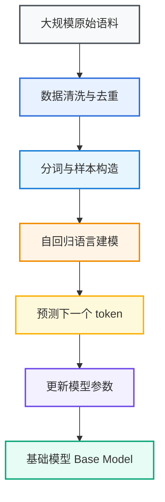
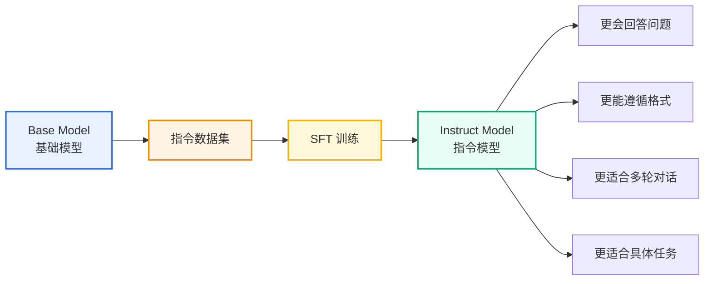
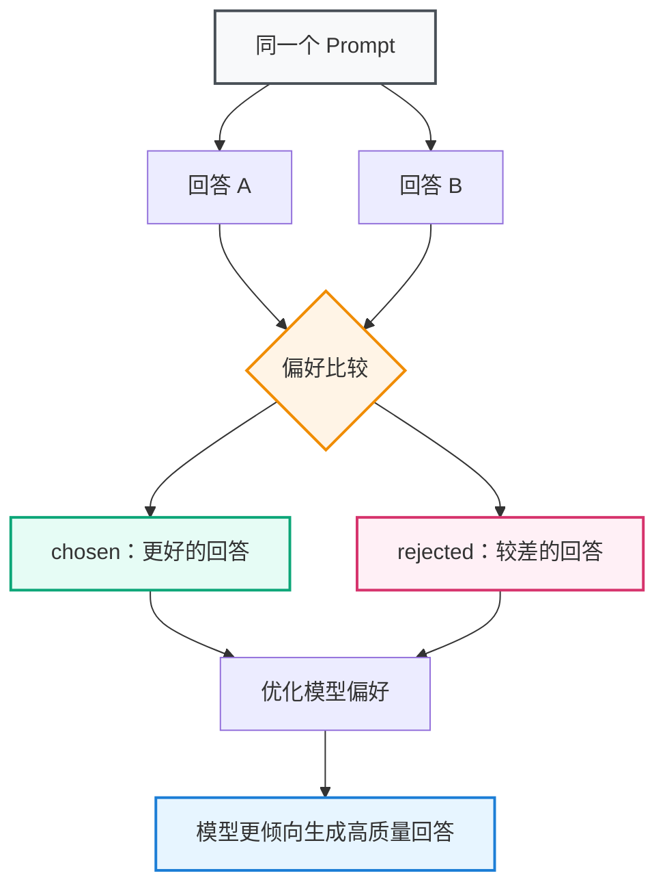
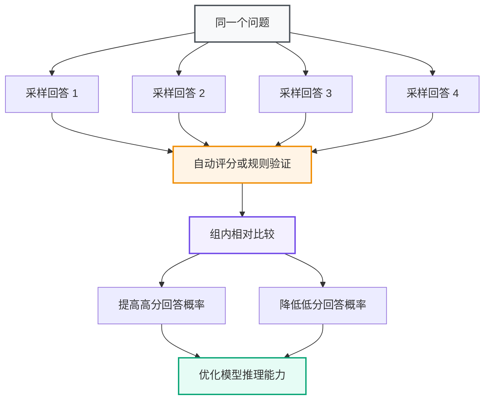
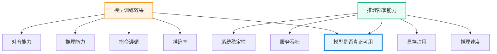
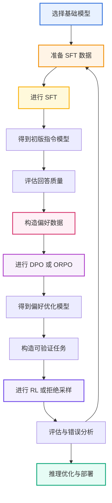
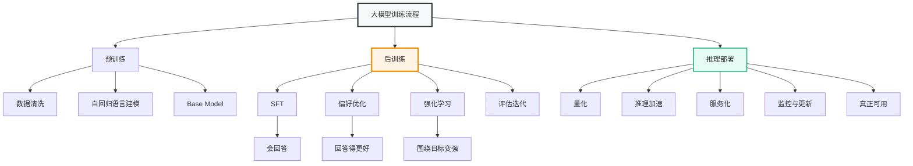

# 第 2 章 大模型训练流程总览

## 本章导读

上一章介绍了“后训练是什么”，本章开始进一步回答一个更重要的问题：**一个大模型到底是怎样从基础模型一步步变成可用模型的？**

很多初学者在学习大模型时，会把 SFT、DPO、RLHF、GRPO、LoRA、量化、部署等概念混在一起。它们确实都和大模型训练或应用有关，但并不处在同一个阶段，也不解决同一个问题。

本章按照训练流程进行梳理，把大模型从原始训练到应用落地的过程拆成五个阶段：

1. 预训练阶段；
2. 监督微调阶段；
3. 偏好优化阶段；
4. 强化学习阶段；
5. 推理优化与部署阶段。

通过本章，你需要建立一个基本认知：

> 大模型训练不是一个单点算法问题，而是一条由数据、模型、训练、评估和部署共同组成的工程流水线。

---

## 2.1 大模型训练流程总览

从整体上看，一个大模型通常会经历如下过程：


<div align="center"><strong>图 2-1 大模型从训练到应用的整体流程</strong></div>

这条流程可以简单理解为：

- **预训练**：让模型获得基础语言能力和知识能力；
- **SFT**：让模型学会按照指令回答；
- **偏好优化**：让模型学会什么回答更好；
- **强化学习后训练**：让模型围绕目标能力持续优化；
- **推理优化与部署**：让模型真正可用、可跑、可服务。

这几个阶段不是完全割裂的。在真实项目中，后训练往往是一个反复迭代的过程：先训练一个版本，再评估错误案例，然后重新清洗数据、补充数据、调整训练方法，继续训练下一版。

---


<div align="center">

<table>
  <thead>
    <tr>
      <th>阶段</th>
      <th>核心目标</th>
      <th>典型输入</th>
      <th>典型输出</th>
      <th>关注重点</th>
    </tr>
  </thead>
  <tbody>
    <tr>
      <td>预训练</td>
      <td>学习语言规律和通用知识</td>
      <td>大规模文本、代码、多模态语料</td>
      <td>Base Model</td>
      <td>规模、质量、覆盖面</td>
    </tr>
    <tr>
      <td>监督微调</td>
      <td>学会按照指令完成任务</td>
      <td>指令数据、问答数据、对话数据</td>
      <td>Instruct Model</td>
      <td>指令遵循、格式稳定</td>
    </tr>
    <tr>
      <td>偏好优化</td>
      <td>学会区分好回答和差回答</td>
      <td>chosen / rejected 偏好对</td>
      <td>Aligned Model</td>
      <td>有用性、准确性、偏好对齐</td>
    </tr>
    <tr>
      <td>强化学习</td>
      <td>围绕奖励信号优化目标能力</td>
      <td>任务、奖励函数、采样回答</td>
      <td>Reasoning / Chat Model</td>
      <td>推理能力、目标任务表现</td>
    </tr>
    <tr>
      <td>推理优化与部署</td>
      <td>降低推理成本并支撑应用</td>
      <td>模型权重、服务框架、硬件资源</td>
      <td>可部署服务</td>
      <td>延迟、吞吐、显存、稳定性</td>
    </tr>
  </tbody>
</table>


<div align="center"><strong>表 2-1 大模型训练流程中的主要阶段</strong></div>

---

## 2.2 预训练阶段

预训练是大模型训练的第一阶段，也是成本最高、规模最大的一部分。

### 2.2.1 预训练的目标

预训练的目标是让模型从海量数据中学习通用模式。  
这些模式包括语言规律、事实知识、代码结构、数学表达、逻辑关系、常见推理路径等。

从训练形式上看，主流语言模型通常采用**自回归语言建模**目标。也就是说，模型根据前面的 token 预测下一个 token。

例如：

```text
输入：大模型后训练的主要目标是提升模型的
预测：指令遵循能力
```

通过海量样本的反复训练，模型逐渐学会在不同上下文中预测合理的下一个 token。表面上看，这是一个“文本预测任务”；但当训练数据足够大、模型容量足够强时，模型会在这个过程中形成复杂的语言理解、知识组织和模式归纳能力。

---




<div align="center"><strong>图 2-2 预训练阶段的基本逻辑</strong></div>

### 2.2.2 预训练数据

预训练数据通常包括：

- 网页文本；
- 书籍；
- 百科；
- 论文；
- 新闻；
- 论坛；
- 代码仓库；
- 数学文本；
- 多语言语料；
- 经过筛选的高质量领域数据。

预训练数据决定了模型能接触到什么知识，也影响模型的语言风格、知识覆盖、代码能力和推理潜力。

但是，数据并不是越多越好。低质量数据、重复数据、污染数据和格式混乱的数据都会影响模型质量。因此，预训练阶段通常非常重视数据清洗、去重、质量过滤和配比设计。

### 2.2.3 预训练产物：Base Model

预训练完成后得到的是 **Base Model**，也就是基础模型。

Base Model 通常具备较强的文本生成能力，但它不一定会稳定地回答用户问题。它更像是一个“通用文本续写器”，而不是一个“可直接使用的助手”。

例如，用户输入：

```text
请总结一下后训练的作用。
```

Base Model 可能会回答，也可能只是继续补写相关文本。它对“指令”的理解和执行并不一定稳定。

因此，在 Base Model 之后，还需要进入后训练阶段。

---

## 2.3 监督微调阶段

监督微调，也就是 **SFT（Supervised Fine-Tuning）**，是后训练中最基础、最常见的阶段。

### 2.3.1 SFT 的目标

SFT 的目标是让模型从“会生成文本”变成“会按照指令回答”。

它通过大量人工或模型构造的输入输出样本，告诉模型：

- 用户提出问题时应该如何回答；
- 不同任务应该采用什么输出格式；
- 多轮对话中如何承接上下文；
- 面对代码、数学、写作、总结等任务时如何组织答案。

### 2.3.2 SFT 数据形式

SFT 数据通常是“输入—输出”结构。

单轮指令样例如下：

```json
{
  "instruction": "请用三句话解释什么是 SFT",
  "input": "",
  "output": "SFT 是监督微调的简称。它使用高质量的输入输出样本训练模型，让模型学会按照人类指令回答问题。SFT 通常是基础模型变成指令模型的重要步骤。"
}
```

多轮对话样例如下：

```json
[
  {
    "role": "user",
    "content": "什么是后训练？"
  },
  {
    "role": "assistant",
    "content": "后训练是指在基础模型预训练完成后，为提升指令遵循、任务完成和偏好对齐能力而进行的训练过程。"
  },
  {
    "role": "user",
    "content": "它和 SFT 是一回事吗？"
  },
  {
    "role": "assistant",
    "content": "不是。SFT 是后训练的一部分，而后训练还包括偏好优化、强化学习、工具调用训练等阶段。"
  }
]
```

---




<div align="center"><strong>图 2-3 SFT 如何把基础模型变成指令模型</strong></div>

### 2.3.3 SFT 的优点

SFT 的优点是简单、直接、稳定。

它适合解决以下问题：

- 模型不会按指令回答；
- 模型回答格式混乱；
- 模型不熟悉某类任务；
- 模型缺少多轮对话习惯；
- 模型需要适配某个领域或应用场景。

### 2.3.4 SFT 的局限

SFT 的局限也很明显：它主要是在模仿训练数据。

如果训练数据质量不高，模型就可能学到错误模式。  
如果训练数据过于模板化，模型就可能输出僵硬、套路化的回答。  
如果训练数据缺少困难样本，模型在复杂任务上的表现仍然可能不稳定。

因此，SFT 通常不是后训练的终点。完成 SFT 后，还需要进一步进行偏好优化或强化学习。

---

## 2.4 偏好优化阶段

SFT 让模型“会回答”，但不一定让模型“回答得最好”。  
偏好优化关注的是：**在多个可能回答中，哪个更好？**

### 2.4.1 偏好数据是什么

偏好数据通常由三部分组成：

```json
{
  "prompt": "请解释什么是后训练",
  "chosen": "后训练是指在基础模型预训练完成后，通过 SFT、偏好优化和强化学习等方法，让模型更好地遵循指令、完成任务并符合人类偏好的训练过程。",
  "rejected": "后训练就是后面再训练一下。"
}
```

其中：

- **prompt** 是用户输入；
- **chosen** 是更好的回答；
- **rejected** 是较差的回答。

偏好优化不是简单告诉模型“标准答案是什么”，而是告诉模型“两个答案中哪个更好”。

---




<div align="center"><strong>图 2-4 偏好优化的基本思想</strong></div>

### 2.4.2 偏好优化解决什么问题

偏好优化主要解决以下问题：

- 回答是否更准确；
- 回答是否更完整；
- 回答是否更符合人类偏好；
- 回答是否更简洁；
- 回答是否更有帮助；
- 回答是否减少幻觉；
- 回答是否更符合安全边界；
- 回答是否更符合特定任务标准。

例如，对于“解释 SFT”这个问题，下面两个回答都不是完全不能用，但质量明显不同。

<div align="center">

<table>
  <thead>
    <tr>
      <th>回答</th>
      <th>内容</th>
      <th>评价</th>
    </tr>
  </thead>
  <tbody>
    <tr>
      <td>回答 A</td>
      <td>SFT 就是微调。</td>
      <td>过于简略，信息量不足</td>
    </tr>
    <tr>
      <td>回答 B</td>
      <td>SFT 是监督微调，它使用高质量输入输出样本训练模型，使模型学会按照指令完成任务。</td>
      <td>更准确、更完整、更适合教学</td>
    </tr>
  </tbody>
</table>


<div align="center"><strong>表 2-2 偏好优化关注的是回答质量差异</strong></div>

### 2.4.3 常见偏好优化方法

常见偏好优化方法包括：

- **DPO**：Direct Preference Optimization，直接偏好优化；
- **IPO**：Identity Preference Optimization；
- **KTO**：Kahneman-Tversky Optimization；
- **ORPO**：Odds Ratio Preference Optimization；
- **SimPO**：Simple Preference Optimization。

其中，DPO 是最常见的入门方法之一。它不需要单独训练奖励模型，也不需要像 PPO 那样进行复杂的强化学习流程，因此非常适合个人实验和中小规模后训练项目。

### 2.4.4 偏好优化与 RLHF 的关系

传统 RLHF 通常包含三个步骤：

1. 用人工示范数据做 SFT；
2. 用人类偏好数据训练奖励模型；
3. 用 PPO 等强化学习算法优化模型。

InstructGPT 的训练流程就是经典案例：先使用人工示范进行监督微调，再根据人类排序训练奖励模型，最后使用 PPO 进行强化学习优化。这个流程证明了“更大的模型不一定更会遵循用户意图”，后训练对对齐用户意图非常关键。[^instructgpt]

DPO 这类方法可以看作是对传统 RLHF 流程的一种简化：它绕过显式奖励模型和复杂 RL 过程，直接利用偏好对优化模型。

---

## 2.5 强化学习阶段

强化学习后训练关注的是：**如何让模型围绕某个目标，通过奖励信号持续优化。**

如果说 SFT 是“看标准答案学习”，偏好优化是“比较好答案和差答案”，那么强化学习更像是“在任务中反复尝试，根据得分调整策略”。

### 2.5.1 RLHF

**RLHF** 是 Reinforcement Learning from Human Feedback，即基于人类反馈的强化学习。

典型流程如下：


<div align="center"><strong>图 2-5 RLHF 的基本流程</strong></div>

RLHF 的核心优势是可以利用人类偏好作为优化信号，让模型在复杂、主观、难以用单一指标衡量的任务上更符合用户期待。

但 RLHF 的工程复杂度较高。它通常需要：

- 收集大量人类偏好数据；
- 训练奖励模型；
- 设计稳定的 RL 训练策略；
- 控制模型不要偏离原有能力；
- 防止奖励黑客和训练不稳定。

### 2.5.2 RLAIF

**RLAIF** 是 Reinforcement Learning from AI Feedback，即基于 AI 反馈的强化学习。

它和 RLHF 的区别在于，反馈来源不完全依赖人类，而是可以由更强模型、规则系统、自动评估器或多个评审模型提供。

RLAIF 的优势是可扩展性更强，成本相对更低。  
但它也有风险：如果 AI 反馈本身存在偏差，模型可能会学习到错误偏好。

### 2.5.3 GRPO

**GRPO** 是 Group Relative Policy Optimization。  
它常用于推理型模型训练，核心思想是：对同一个问题采样多个回答，然后根据组内相对表现来优化模型。

与传统 PPO 相比，GRPO 的一个重要特点是可以在一定程度上避免单独训练价值模型，从而降低训练复杂度。

---




<div align="center"><strong>图 2-6 GRPO 的直观理解</strong></div>

DeepSeek-R1-Zero 是一个典型案例。公开论文中，DeepSeek-R1-Zero 直接从 DeepSeek-V3-Base 出发，使用 GRPO 进行大规模强化学习，在没有先进行监督微调的情况下激发出较强的推理行为；而 DeepSeek-R1 则进一步加入 cold-start SFT、推理强化学习、拒绝采样与 SFT、以及面向全场景的强化学习，以改善可读性、语言一致性和通用可用性。[^deepseekr1]

### 2.5.4 强化学习适合什么任务

强化学习后训练更适合有明确反馈信号的任务，例如：

- 数学推理；
- 代码生成；
- 单元测试通过；
- 逻辑推理；
- 工具调用；
- 多步规划；
- 格式验证；
- 答案可自动判定的任务。

如果一个任务的输出可以通过规则、测试、评测器或外部环境进行打分，那么它就更适合引入强化学习。

---

## 2.6 推理优化与部署阶段

训练完成并不意味着模型就能直接投入使用。  
实际应用中还需要考虑推理成本、响应速度、显存占用、并发能力和服务稳定性。

这就进入了推理优化与部署阶段。

### 2.6.1 为什么需要推理优化

大模型通常参数量大、显存占用高、推理速度慢。  
如果不进行优化，即使模型效果很好，也可能无法在实际场景中落地。

常见问题包括：

- 单次回答延迟太高；
- 显存占用太大；
- 并发能力不足；
- 部署成本过高；
- 长上下文推理速度慢；
- 多用户请求时服务不稳定。

### 2.6.2 常见推理优化方法

常见推理优化方法包括：

<div align="center">

<table>
  <thead>
    <tr>
      <th>方法</th>
      <th>作用</th>
      <th>典型收益</th>
    </tr>
  </thead>
  <tbody>
    <tr>
      <td>量化</td>
      <td>降低权重精度</td>
      <td>减少显存占用</td>
    </tr>
    <tr>
      <td>KV Cache</td>
      <td>缓存历史注意力结果</td>
      <td>加速自回归生成</td>
    </tr>
    <tr>
      <td>FlashAttention</td>
      <td>优化注意力计算</td>
      <td>提升长序列效率</td>
    </tr>
    <tr>
      <td>Continuous Batching</td>
      <td>动态合并请求</td>
      <td>提升服务吞吐</td>
    </tr>
    <tr>
      <td>Speculative Decoding</td>
      <td>使用小模型辅助生成</td>
      <td>降低生成延迟</td>
    </tr>
    <tr>
      <td>vLLM / TensorRT-LLM</td>
      <td>高性能推理框架</td>
      <td>提升部署效率</td>
    </tr>
  </tbody>
</table>


<div align="center"><strong>表 2-3 常见推理优化方法</strong></div>

### 2.6.3 部署不是训练的附属环节

很多人学习大模型时只关注训练，但在真实项目中，部署同样关键。

一个模型是否可用，不只取决于它的 benchmark 分数，还取决于：

- 是否能在现有 GPU 上运行；
- 是否能支持目标并发量；
- 是否能稳定处理长上下文；
- 是否能被业务系统调用；
- 是否能监控失败案例；
- 是否能持续迭代更新。

因此，完整的大模型训练流程必须把“训练”和“部署”放在一起考虑。

---




<div align="center"><strong>图 2-7 训练效果与部署可用性的关系</strong></div>

---

## 2.7 一个完整后训练流程示例

为了把前面的阶段串起来，这里给出一个面向“通用问答助手”的简化后训练流程。

### 2.7.1 项目目标

假设我们要把一个基础模型训练成一个更适合中文问答、技术解释和多轮对话的助手模型。

目标包括：

- 能用中文稳定回答问题；
- 能解释技术概念；
- 能遵循格式要求；
- 能进行多轮对话；
- 回答尽量准确、简洁、有帮助；
- 在不确定时能够表达不确定性。

### 2.7.2 简化训练流程



<div align="center"><strong>图 2-8 一个简化的后训练项目流程</strong></div>

### 2.7.3 每个阶段做什么

<div align="center">

<table>
  <thead>
    <tr>
      <th>阶段</th>
      <th>具体工作</th>
      <th>产物</th>
    </tr>
  </thead>
  <tbody>
    <tr>
      <td>基础模型选择</td>
      <td>选择 Qwen、Llama、DeepSeek 等合适尺寸模型</td>
      <td>Base / Instruct 起点</td>
    </tr>
    <tr>
      <td>SFT 数据准备</td>
      <td>构造问答、解释、多轮对话、格式控制数据</td>
      <td>SFT 数据集</td>
    </tr>
    <tr>
      <td>SFT 训练</td>
      <td>用 LoRA 或 QLoRA 进行监督微调</td>
      <td>初版指令模型</td>
    </tr>
    <tr>
      <td>初步评估</td>
      <td>检查回答质量、格式、幻觉、任务能力</td>
      <td>错误案例集合</td>
    </tr>
    <tr>
      <td>偏好数据构造</td>
      <td>将好回答和差回答组成 chosen / rejected 对</td>
      <td>偏好数据集</td>
    </tr>
    <tr>
      <td>偏好优化</td>
      <td>使用 DPO、ORPO 等方法优化回答偏好</td>
      <td>对齐模型</td>
    </tr>
    <tr>
      <td>RL 或拒绝采样</td>
      <td>对可验证任务进行采样、筛选和强化训练</td>
      <td>更强任务模型</td>
    </tr>
    <tr>
      <td>推理部署</td>
      <td>量化、服务化、监控、上线</td>
      <td>可用模型服务</td>
    </tr>
  </tbody>
</table>

</div>

<div align="center"><strong>表 2-4 一个简化后训练项目中的工作分解</strong></div>

这个流程体现了一个重要思想：

> 后训练不是“拿数据训一次模型”就结束，而是一个“训练—评估—发现问题—修正数据—继续训练”的迭代过程。

---

## 2.8 本章小结

本章按照训练流程介绍了大模型从基础模型到应用落地的完整链路。

可以总结为以下几点：

1. **预训练**用于学习语言规律、通用知识和基础模式，产物是 Base Model。
2. **SFT**用于让模型学会按照指令回答，产物通常是 Instruct Model。
3. **偏好优化**用于让模型学会区分好回答和差回答，提升回答质量和人类偏好对齐能力。
4. **强化学习后训练**用于让模型围绕明确奖励信号持续优化，尤其适合数学、代码、推理、工具调用等可验证任务。
5. **推理优化与部署**决定模型能否真正落地，训练效果和部署效率必须同时考虑。
6. **完整后训练流程是迭代式的**，需要不断通过评估和失败案例分析来反向改进数据与训练方法。

---

## 本章核心图谱



<div align="center"><strong>图 2-9 本章核心图谱</strong></div>

---

## 思考题与参考答案

### 问题 1：为什么大模型训练流程不能只看 SFT？

**参考答案：**

因为 SFT 只是后训练中的一个阶段。它主要解决“模型会不会按照指令回答”的问题，但不能充分解决“回答是否最优”“是否符合人类偏好”“复杂任务中是否稳定”“是否能通过外部验证”等问题。

完整流程还需要偏好优化、强化学习、评估迭代和推理部署。只看 SFT 容易把后训练理解成简单微调，而忽略模型质量、偏好对齐和工程落地。

---

### 问题 2：预训练模型为什么不能直接作为聊天模型使用？

**参考答案：**

预训练模型主要学习的是文本分布和语言规律，它的核心训练目标是预测下一个 token，而不是理解用户意图并完成任务。

因此，预训练模型虽然具备知识和语言能力，但不一定会稳定地遵循指令、控制格式、维持多轮对话，也不一定知道什么回答更符合人类偏好。要把它变成聊天模型，通常还需要 SFT、偏好优化和安全对齐等后训练过程。

---

### 问题 3：SFT、偏好优化和强化学习分别解决什么问题？

**参考答案：**

可以用一句话概括：

- SFT 解决“会不会回答”的问题；
- 偏好优化解决“回答得好不好”的问题；
- 强化学习解决“能不能围绕目标持续变强”的问题。

更具体地说，SFT 让模型学习标准答案格式和任务模式；偏好优化让模型倾向于生成更有帮助、更准确、更符合人类偏好的回答；强化学习则通过奖励信号优化模型在特定任务中的表现。

---

### 问题 4：为什么后训练流程通常需要反复迭代？

**参考答案：**

因为模型第一次训练后一定会暴露问题。例如，回答格式不稳定、复杂任务失败、某些类型问题幻觉严重、对特定约束不敏感等。

这些问题需要通过评估和失败案例分析发现，然后反向改进数据、训练目标和评估方法。因此，后训练不是一次性过程，而是“训练—评估—错误分析—数据修正—继续训练”的循环。

---

### 问题 5：为什么部署阶段也应该算入完整的大模型流程？

**参考答案：**

因为模型效果好并不等于模型可用。  
如果一个模型推理速度太慢、显存占用太高、并发能力太差，即使 benchmark 分数很高，也很难进入真实业务系统。

部署阶段需要解决延迟、吞吐、显存、稳定性、监控和持续更新等问题。对于实际项目来说，训练只是让模型“有能力”，部署才是让模型“能服务”。

## 推荐阅读顺序

读完本章后，可以继续阅读：

```text
第 3 章 基础模型选择
→ 第 4 章 SFT：监督微调
→ 第 5 章 参数高效微调方法
→ 第 6 章 偏好学习与偏好优化
→ 第 7 章 强化学习后训练
```

本章的重点是建立流程意识。后续章节会分别展开每个关键环节：先理解如何选择基础模型，再学习 SFT、参数高效微调、偏好优化和强化学习。

---

## 参考资料

[^instructgpt]: Ouyang et al., *Training language models to follow instructions with human feedback*, NeurIPS 2022.  
[^deepseekr1]: DeepSeek-AI, *DeepSeek-R1: Incentivizing Reasoning Capability in LLMs via Reinforcement Learning*, 2025.
